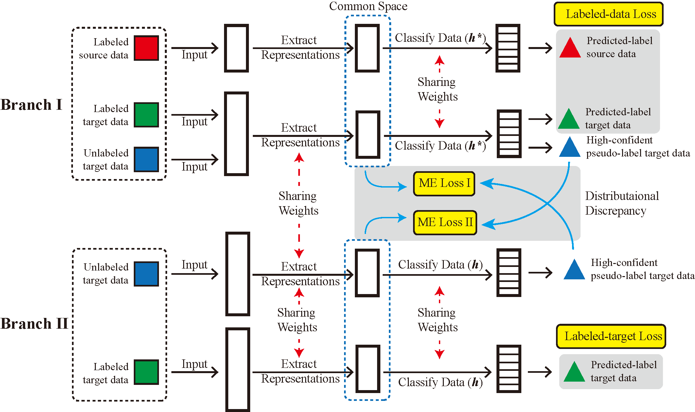

# Code for Joint Mean Embedding Alignment (TPAMI'22)
Hi, this is the python code for Joint Mean Embedding Alignment, published in the TPAMI2022 paper "Semi-Supervised Heterogeneous Domain Adaptation: Theory and Algorithms" (https://ieeexplore.ieee.org/stamp/stamp.jsp?arnumber=9695325). This work is done by 

- Dr. Zhen Fang (UTS), zhen.fang@uts.edu.au
- Prof. Jie Lu (UTS), jie.lu@uts.edu.au
- Dr. Feng Liu (UniMelb), feng.liu1@unimelb.edu.au
- A/Prof. Guangquan Zhang (UTS), guangquan.zhang@uts.edu.au

# Abstract
Semi-supervised heterogeneous domain adaptation (SsHeDA) aims to train a classifier for the target domain, in which only unlabeled and a small number of labeled data are available. This is done by leveraging knowledge acquired from a heterogeneous source domain. From algorithmic perspectives, several methods have been proposed to solve the SsHeDA problem; yet there is still no theoretical foundation to explain the nature of the SsHeDA problem or to guide new and better solutions. Motivated by compatibility condition in semi-supervised probably approximately correct (PAC) theory, we explain the SsHeDA problem by proving its generalization error – that is, why labeled heterogeneous source data and unlabeled target data help to reduce the target risk. Guided by our theory, we devise two algorithms as proof of concept. One, *kernel heterogeneous domain alignment* (KHDA), is a kernel-based algorithm; the other, *joint mean embedding alignment* (JMEA), is a neural network-based algorithm. When a dataset is small, KHDA's training time is less than JMEA's. When a dataset is large, JMEA is more accurate in the target domain. Comprehensive experiments with image/text classification tasks show KHDA to be the most accurate among all non-neural network baselines, and JMEA to be the most accurate among all baselines.

<p align="center">
    
</p>
<p align="center">
Fig. Overview of JMEA.
</p>

# Software version
Tensorflow (gpu) version is 1.14.0. Python version is 3.7.3. CUDA version is 11.2.

The main_J python requires some basic scientific computing python packages, e.g., numpy, sklearn and matplotlib. I recommend users to install python via Anaconda (python 3.7.3), which can be downloaded from https://www.anaconda.com/distribution/#download-section . If you have installed Anaconda, then you do not need to worry about these basic packages.

# Download data

Since Github does not allow big-size file (>25MB), we provide google-drive links of datasets we used in our paper (some are larger than 7GB):

ImageCLEF: https://drive.google.com/drive/folders/1mxi-4MYdvC76U_eKQ_gLXY_EHvG0otHT?usp=sharing

CIFAR+ImageNET: https://drive.google.com/drive/folders/1r5Co_2rHWtVRqqre_aJlsYJ2gASFdQJM?usp=sharing

Reuters-21578: https://drive.google.com/drive/folders/1A0gdUWO7JdJQi8eDEL6xmQmfIiPpRFbp?usp=share_link

FOOD: https://drive.google.com/drive/folders/1jSObfV513uO4uuf3Wha1h_kGWmQ0uPgV?usp=share_link

Office_Caltech10: https://drive.google.com/drive/folders/12iTh2DP0W3l_rtQ3ChTwx5sLsXq-Kei2?usp=share_link

WIKI: https://drive.google.com/drive/folders/1jn6ZqtqOu4ikdWwTL7YajELkVjv0YMTy?usp=sharing

After you download both data, you should run main_J.py successfully (remember to move data to the data folder, as decriped in add_dependencies.py). Hyperparameters are set in Line 145 of JEMME.py.

# For datasets provided,

run

```
python main_J.py
```

you can obtain the accuracy of JMEA.


# Citation
If you are using this code for your own researching, please consider citing
```
@inproceedings{fang2020semi,
  author={Fang, Zhen and Lu, Jie and Liu, Feng and Zhang, Guangquan},
  journal={IEEE Transactions on Pattern Analysis and Machine Intelligence}, 
  title={Semi-Supervised Heterogeneous Domain Adaptation: Theory and Algorithms}, 
  year={2023},
  volume={45},
  number={1},
  pages={1087-1105},
  doi={10.1109/TPAMI.2022.3146234}
}
```

# Acknowledgment
This work was supported in part by Australian Research Council (ARC) under Grant FL190100149. We also thank STN's authors to provide their code. Our code is based on the code of STN.
